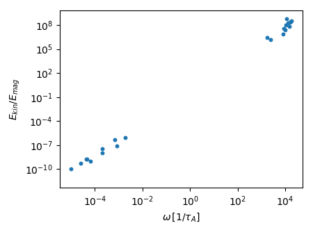

# Modified Malkus modes in an ellipsoid

Some details are skipped here, which are already shown in the inertial mode example.

We want to solve the linearized momentum equation including the Lorentz force

$$\partial_t \mathbf{u} = -\frac{2}{\mathrm{Le}}\mathbf{\Omega}\times\mathbf{u}-\nabla p + \left(\nabla\times\mathbf{B}\right)\times\mathbf{B}_0 + \left(\nabla\times\mathbf{B}_0\right)\times\mathbf{B},$$

with $\mathbf{B}_0 = \mathbf{B}_0(\mathbf{r})$, and $\left[\mathbf{u},\mathbf{B}\right] = \left[ \mathbf{u},\mathbf{B}\right](\mathbf{r})\exp(i\omega t)$. 

The evolution of the magnetic field is given by the diffusionless induction equation

$$\partial_t \mathbf{B} = \nabla\times\left(\mathbf{u}\times\mathbf{B}_0\right).$$

The magnetohydrodynamic problem is non-dimensionalized using a characteristic length $L$ (e.g. core radius) and the Alfv\'en wave period $\tau_A$ as a characteristic length scale. The arising non-dimensional number is the Lehnert number $Le = B_0/(L\Omega \sqrt{\rho\mu_0})$, giving the ratio between the rotation period and the Alfv\'en wave period.

## Setting up and solving the problem


```julia

using Mire, LinearAlgebra

a,b,c = 1.1,0.9,0.7
V = Ellipsoid(a,b,c)
Ω = [0.0,0.0,1.0]
Le = 1e-4 #Lehnert number.
N = 3
B₀ = [-y/b^2,x/a^2,0] #Modified Malkus field adapted to the shape of the Ellipsoid.

# create magnetohydrodynamic problem, using 3-D LebovitzBasis for the velocity 
# and ConductingMFBasis for the magnetic field:
p = MHDProblem(N, V, Ω, Le, B₀, LebovitzBasis, ConductingMFBasis) 
assemble!(p; threads=false)

```

Then solve the dense generalized eigen problem

```
A, B = Matrix(p.RHS), Matrix(p.LHS)
evals, evecs = eigen(A, B)
```

Given the eigen values `evals` and eigen vectors `evecs`.

The eigen vectors $\mathbf{x}_i$ contain the $n=n_u+n_b$ coefficients $x_{ji}$, so that the eigen velocity $\mathbf{u}_i$ and magnetic field $\mathbf{B}_i$ are given by

$$\mathbf{u}_i = \sum_{j=1}^{n_u}x_{ji}\tilde{\mathbf{u}}_j, \mathbf{B}_i = \sum_{j=n_u+1}^{n}x_{ji}\tilde{\mathbf{B}}_j,$$

where $\tilde{\mathbf{u}}_j$, $\tilde{\mathbf{B}}_j$ are the $j$-th basis vectors in `p.vbasis.el` and `p.bbasis.el`.

We can reconstruct the velocities $\mathbf{u}_i$ and magnetic fields $\mathbf{B}_i$ for all $i$ by calling `velocities` and `magneticfields`, respectively:


```julia
u = velocities(p.vbasis.el, evecs)
B = magneticfields(p.bbasis.el, evecs)
```

`u` and `B` are now arrays of 3-D vectors where the components are Cartesian polynomials with complex coefficients.

## Plotting the kinetic to magnetic energy spectrum of modes

We can calculate the kinetic energy 

$$E_\mathrm{kin} = \frac{1}{2}\int\mathbf{u}\cdot\mathbf{u}\,\mathrm{d}V,$$

and magnetic energy

$$E_\mathrm{mag} = \frac{1}{2}\int\mathbf{B}\cdot\mathbf{B}\,\mathrm{d}V,$$

for all modes by calling
```julia
ekin = [inner_product(u,u, p.cmat)/2 for u in u]
emag = [inner_product(B,B, p.cmat)/2 for B in B]
```

Then, the frequency to Energy ratio spectrum can be plotted by

```julia
using PyPlot

ekm = abs.(ekin./emag)

ω = abs.(imag.(evals))
loglog(ω, ekm, ".")
xlabel(L"\omega\, [1/\tau_A]")
ylabel(L"E_{kin}/E_{mag}")
```


